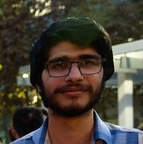

  

# Farzan Byramji

I am a third year PhD student in the [UCSD theory group](https://cstheory.ucsd.edu/), where I am fortunate to be advised by [Shachar Lovett](http://cseweb.ucsd.edu/~slovett/home.html) and [Russell Impagliazzo](https://cseweb.ucsd.edu/~russell/). Previously, I was a student in the CSE department of IIT Kanpur, where I worked with [Rajat Mittal](https://www.cse.iitk.ac.in/users/rmittal/) and got a BT-MT dual degree.

My research interests lie broadly in complexity theory and combinatorics. I am particularly interested in questions about propositional proof systems, Boolean circuits, decision trees and communication protocols.

Email: fbyramji at ucsd dot edu

## Research
- **On the Advantage of Adaptivity for Sampling with Cell Probes**  
  with Daniel M. Kane, Jackson Morris and Anthony Ostuni  
  Manuscript, 2026  
  \[[arXiv](https://arxiv.org/abs/2605.12873) \| [ECCC](https://eccc.weizmann.ac.il/report/2026/075/)\]

- **Hard-to-Sample Distributions from Robust Extractors**  
  with Daniel M. Kane, Jackson Morris and Anthony Ostuni  
  Manuscript, 2026  
  \[[arXiv](https://arxiv.org/abs/2604.26179) \| [ECCC](https://eccc.weizmann.ac.il/report/2026/081/)\]

- **Quantum-Classical Equivalence for AND-Functions**  
  with Sreejata K. Bhattacharya, Arkadev Chattopadhyay, Yogesh Dahiya, and Shachar Lovett  
  CCC 2026  
  \[[arXiv](https://arxiv.org/abs/2606.03249) \| [ECCC](https://eccc.weizmann.ac.il/report/2026/013/)\]

- **Lower Bounds for Near-Quadratic-Depth Resolution over Parities**  
  with Sreejata K. Bhattacharya, Arkadev Chattopadhyay, and Russell Impagliazzo  
  [STOC 2026](https://doi.org/10.1145/3798129.3800809)  
  Merge of the following two papers:  
    - **Exponential Lower Bounds on the Size of ResLin Proofs of Nearly Quadratic Depth**  
      Sreejata K. Bhattacharya, Arkadev Chattopadhyay  
      \[[arXiv](https://www.arxiv.org/abs/2507.23008) \| [ECCC](https://eccc.weizmann.ac.il/report/2025/106)\]  
    - **Lower Bounds for Bit Pigeonhole Principles in Bounded-Depth Resolution over Parities**  
      Farzan Byramji, Russell Impagliazzo  
      \[[arXiv](https://arxiv.org/abs/2511.20023) \| [ECCC](https://eccc.weizmann.ac.il/report/2025/118/)\]

- **Lifting to Randomized Parity Decision Trees**  
  with Russell Impagliazzo  
  [RANDOM 2025](https://doi.org/10.4230/LIPIcs.APPROX/RANDOM.2025.55)  
  \[[ECCC](https://eccc.weizmann.ac.il/report/2024/202/)\]

- **Relations between monotone complexity measures based on decision tree complexity**  
  with Vatsal Jha, Chandrima Kayal, and Rajat Mittal  
  [COCOON 2024](https://doi.org/10.1007/978-981-96-1090-7_11)  
  \[[arXiv](https://arxiv.org/abs/2406.07859) \| [ECCC](https://eccc.weizmann.ac.il/report/2024/103/)\]

- **Query complexity of Boolean functions on slices**  
  [Discrete Mathematics, 2024](https://doi.org/10.1016/j.disc.2024.113954)  
  \[[arXiv](https://arxiv.org/abs/2211.16402)\]

- **A bijection between symmetric valleys in Dyck paths and even degree internal vertices in ordered trees**  
  [INTEGERS, 2022](https://math.colgate.edu/~integers/w35/w35.pdf)  

